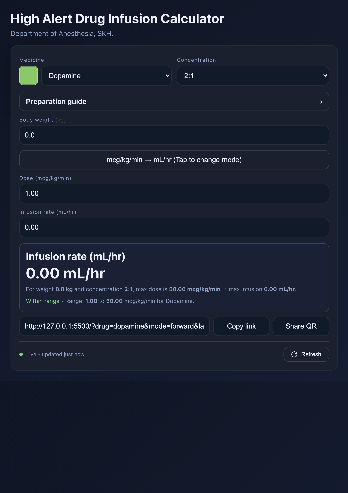

Awesome — here’s a complete **README.md** you can drop into your repo. It includes setup, deploy, live refresh, and a full step-by-step “Edit the database” section.

---

# High-Alert Drug Infusion Calculator

Single-page web app that computes infusion rates (mcg/kg/min ↔ mL/hr) and shows per-drug preparation guides.
Data is maintained in Google Sheets (Editor → Public) and exposed as a lightweight JSON API via Google Apps Script.

**Highlights**

- Instant load with built-in default drugs, then auto-upgrade to live data
- One-click **Refresh** + “updated X ago” status
- Prep guide: ampule + total solution chips with computed volumes
- i18n: English + Thai text labels
- No build step — just static HTML/CSS/JS

> ⚠️ **Clinical safety**
> This tool is for educational/support purposes only. Always confirm doses with your institution’s protocols and clinical judgment.

---

## Demo / Screenshot



---

## Project structure

```
.
├─ index.html        # UI markup
├─ styles.css        # Layout + theming
├─ app.js            # App logic, math, DB refresh UI
└─ apps-script/      # (optional folder in repo)
   └─ publisher.gs   # The Apps Script you paste into the Public sheet
```

---

## Quick start (local)

1. Clone and open the project.
2. Serve locally (or just open `index.html` in a browser):

   ```bash
   npx serve .
   # or: python -m http.server 8080
   ```

3. The app boots with a built-in dataset for instant UI.

> The top **DB bar** indicates whether you’re using built-in data (“Offline”) or the live JSON (“Live”).
> Click **Refresh** to pull the latest database. Click the **left side** of the DB bar to open the public sheet.

---

## Configuration

### 1) Point the app at your JSON endpoint

In `app.js`, set your deployed Apps Script URL:

```js
const DB_URL =
  "https://script.google.com/macros/s/AKfycbx-Hj2g-8aeN72dM6XJtbOnwyZ9MivBXGBlVEF70XKtkT7O14KfBEAetHIHrCOLRp1ayA/exec";
```

### 2) (Optional) Change the “open sheet” link on the DB bar

```js
const PUBLIC_SHEET_URL =
  "https://docs.google.com/spreadsheets/d/1FlAeLOLXkIFDQg41GQ4WKPD_IaIx_nYZb28lPL4ttrA";
```

Now clicking the **left** side of the DB bar opens your Public sheet.

---

## Editing the database (Google Sheets → JSON)

### Overview

You’ll maintain data in a private **Editor** sheet, then “publish” it into a view-only **Public** sheet. The **Public** sheet hosts the Apps Script that validates, formats, and serves the JSON API consumed by this app.

- **Editor sheet**: where you edit (checkboxes, free text, etc.)
- **Public sheet**: mirror used for read-only viewing + JSON endpoint

In the Apps Script (bound to the **Public** sheet), set:

```js
// Apps Script config
const EDIT_SHEET_ID = "1jhCKA1P2vnUBzVfSmlP1TrXsinKdHL4iYKUR4MfV1go";
const TABS = ["drugs", "ampules", "prep_volumes", "synonyms"];
```

### Required tabs & columns

Create the same tabs in **both** sheets with these headers (exact names):

- **drugs**

  - `id` (slug, e.g. `dopamine`; lowercase, no spaces; must be unique)
  - `name`
  - `color` (hex like `#6cc866`)
  - `pMin` (number)
  - `pMax` (number or **blank** for “no max”)
  - `conc` (comma-separated ratios like `4:100, 8:100`)
  - `defaultP` (number)
  - `defaultConc` (must be one of the items in `conc`)
  - `defaultTotal` (integer mL; should be allowed for at least one `conc`)
  - `note_en`, `note_th` (free text)
  - `critical` (**Checkbox** in the Editor; exported as text `TRUE`/`FALSE` in Public)

- **ampules**

  - `drugId` (matches `drugs.id`)
  - `name` (e.g., `250 mg/10 mL (25 mg/mL)`)
  - `sizeMl` (number)
  - `concMgPerMl` (number)

- **prep_volumes**

  - `drugId`
  - `conc` (ratio like `4:100`)
  - `totals` (comma-separated integers, e.g. `100,250,500`)

- **synonyms**

  - `drugId`
  - `synonym` (e.g., `norepi`)

### Editing workflow

1. **Open the Editor sheet** and make changes:

   - Add/edit rows in the four tabs.
   - Keep `id` stable; use lowercase slugs.
   - Use ratio strings for `conc` (`mg:ml`), comma-separated.
   - Keep `critical` as a **Checkbox** (TRUE/FALSE).

2. **Run validation** (Public sheet → **DB Tools → Validate (dry run)**)

   - Fix any issues the dialog/console mentions (see Troubleshooting below).

3. **Publish** (Public sheet → **DB Tools → Publish**)

   - Copies Editor → Public (for the tabs in `TABS`)
   - Formats cells (numbers, clip wrapping, no row resize)
   - Coerces `critical` to **text** `TRUE`/`FALSE` in the Public sheet
   - Builds JSON (also stored at `meta!A1` for quick inspection)

4. **Verify in the app**

   - Click the **Refresh** button in the app’s DB bar.
   - Status shows **Live • updated X ago** when the new JSON is loaded.

### Apps Script (Public sheet)

Create an Apps Script bound to the **Public** sheet and paste the provided `publisher.gs` (from `apps-script/publisher.gs` in this repo). It adds a **DB Tools** menu with:

- Validate (dry run)
- Publish (copy + validate + build JSON)
- Show JSON in a dialog
- `doGet()` web endpoint handler (serves the JSON)

**Deploy the web app** (Extensions → Apps Script → Deploy):

- **Deploy → Web app**
- **Execute as:** _Me_
- **Who has access:** _Anyone_
- Copy the `…/exec` URL into `DB_URL` in `app.js`.

### Field rules & tips

- `id`: stable, lowercase, no spaces; used for joins and URLs.
- `color`: 6-digit hex recommended.
- `pMax`: **leave blank** to mean “no max”. `0` is allowed but flagged as suspicious.
- `conc`: list of `mg:ml` ratios; each must match `^\d+(\.\d+)?:\d+(\.\d+)?$`.
- `defaultConc`: must appear in `conc`.
- `defaultTotal`: should be one of the allowed totals for the chosen `defaultConc`.
- `critical` (Editor): Checkbox → will publish as text `TRUE`/`FALSE`.

### Troubleshooting (validation messages)

- **“Missing sheet: …”** → Ensure the tab exists and is named exactly.
- **“Drug missing id / Duplicate id”** → Fix `id` column in **drugs**.
- **“Bad conc ‘…’ in X”** → Use `mg:ml` format (`4:100`), commas between values.
- **“Bad prep conc … / Bad totals …”** → Check `prep_volumes` ratios and integer lists.
- **“No ampules for X but prep totals exist.”** → Add at least one ampule for any drug that has prep totals.
- **Checkboxes not exporting** → Ensure `critical` is a Checkbox in **Editor**; publish converts it to text in **Public**.

---

## How the app loads data

1. **Instant UI**: Renders immediately with a small **built-in** dataset (`DEFAULT_DRUGS`) so the page never feels frozen.
2. **Upgrade to live**: Fetches the JSON from `DB_URL`.
3. **DB bar**:

   - **Local** (yellow dot): using built-in data.
   - **Live** (green dot): using the latest JSON; “updated X ago” auto-ticks every 30s.
   - **Error** (red dot): last fetch failed (see console).

Click **Refresh** to re-fetch the JSON on demand.
Click the **left side** of the DB bar to open your **Public** Google Sheet.

---

## URL parameters (deep links)

- `drug`: ID or synonym (e.g. `?drug=levophed`)
- `mode`: `forward` or `reverse`
- `conc`: ratio like `4:100`
- `p`: dose (mcg/kg/min)
- `rate`: mL/hr
- `b`: body weight (kg)
- `lang`: `en` or `th`

Example:
`?drug=levophed&conc=4:100&b=70&p=0.10&lang=en`

---

## Development notes

- No external state; all data comes from `DB_URL` JSON.
- No GViz — the app reads the JSON built by Apps Script.
- Prep section computes volumes from ampule concentration and selected total.
- Accessibility: the app uses semantic labels, ARIA where appropriate, and keyboard-friendly chips.

---

## Contributing

PRs welcome for:

- New drugs (update the Sheets)
- Additional locales
- UI refinements or accessibility improvements
- Test fixtures for validation

---

## Acknowledgements

Thanks to SKH Department of Anesthesia for clinical guidance and feedback.
