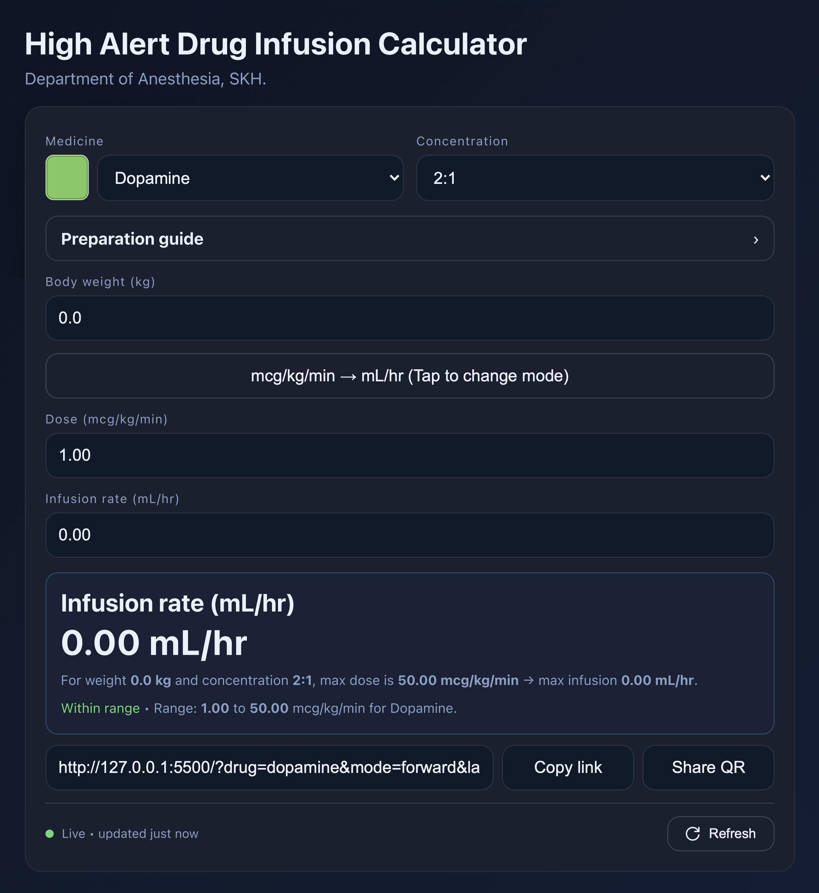

Here’s a tight, publish-ready `README.md` focused on the frontend and the database editing flow (with your links, names, and credits baked in).

---

# High-Alert Drug Infusion Calculator

A lightweight web app that helps clinicians convert **mcg/kg/min ↔ mL/hr** for common vasoactive and high-alert drugs. It renders instantly with a built-in dataset and then upgrades itself from a maintained Google Sheet via a JSON endpoint.



---

## Frontend highlights

- **Instant load, then live upgrade**
  UI renders immediately with built-in defaults, then fetches the latest database JSON in the background.

- **Status + refresh bar**
  A small capsule at the bottom of the card shows whether data is local or live and when it was last updated (e.g. “updated 2 hours ago”).

  - Click **Refresh** to re-fetch the database.
  - Click the **left side** of the bar to open the public Google Sheet (read-only).

- **Two calculation modes**

  - Forward: **mcg/kg/min → mL/hr**
  - Reverse: **mL/hr → mcg/kg/min**

- **Preparation guide**
  Select an **ampule** and **total bag volume** to auto-compute required drug & solvent volumes, with per-drug notes (English/Thai).

- **Deep links + QR sharing**
  The share box captures your current selections. Copy the URL or generate a QR code for quick sharing.

- **Bilingual UI (EN/TH)**
  All key UI labels are localized (English & Thai).

- **Accessible, responsive, no build step**
  Plain HTML/CSS/JS—just open `index.html` or host the folder.

---

## View / consume the database

- **Public Google Sheet (read-only):**
  [https://docs.google.com/spreadsheets/d/1FlAeLOLXkIFDQg41GQ4WKPD_IaIx_nYZb28lPL4ttrA](https://docs.google.com/spreadsheets/d/1FlAeLOLXkIFDQg41GQ4WKPD_IaIx_nYZb28lPL4ttrA)

- **JSON API endpoint (Apps Script):**
  [https://script.google.com/macros/s/AKfycbx-Hj2g-8aeN72dM6XJtbOnwyZ9MivBXGBlVEF70XKtkT7O14KfBEAetHIHrCOLRp1ayA/exec](https://script.google.com/macros/s/AKfycbx-Hj2g-8aeN72dM6XJtbOnwyZ9MivBXGBlVEF70XKtkT7O14KfBEAetHIHrCOLRp1ayA/exec)

**JSON shape (simplified):**

```json
{
  "schemaVersion": 1,
  "dataVersion": "2025-01-01T12:34:56.789Z",
  "drugs": [
    {
      "id": "dopamine",
      "name": "Dopamine",
      "color": "#6cc866",
      "pMin": 1,
      "pMax": 50,
      "conc": ["1:1", "2:1"],
      "defaultP": 1.0,
      "defaultConc": "2:1",
      "defaultTotal": 100,
      "synonyms": ["dopa"],
      "ampules": [
        { "name": "250 mg/10 mL (25 mg/mL)", "sizeMl": 10, "concMgPerMl": 25 }
      ],
      "prepVolumesByConc": { "1:1": [100, 250, 500], "2:1": [100, 250, 500] },
      "prepNote": { "en": "…", "th": "…", "critical": false }
    }
  ]
}
```

---

## How to edit the database (for collaborators)

> If you only need to **view** the data, use the **Public Google Sheet** above.
> If you need **edit** access, ask the maintainer for the private **Editor** workbook.

### Tabs & required columns

The database uses four sheets (tabs). Column headers must match exactly:

1. **`drugs`**

- `id` (lowercase no spaces), `name`, `color` (hex like `#751be3`)
- `pMin`, `pMax` (leave blank if no max)
- `conc` (comma-separated ratios like `1:1, 2:1`)
- `defaultP`, `defaultConc`, `defaultTotal`
- `note_en`, `note_th`
- `critical` (**checkbox** in the Editor; published as `TRUE`/`FALSE` text)

2. **`ampules`**

- `drugId`, `name`, `sizeMl`, `concMgPerMl`

3. **`prep_volumes`**

- `drugId`, `conc` (ratio like `4:100`), `totals` (comma-separated integers, e.g. `50,100,250,500`)

4. **`synonyms`**

- `drugId`, `synonym`

### Edit → Publish workflow

1. **Edit data** in the private **Editor** workbook.
2. Open the **Public** workbook (the one linked above).
3. Use the custom menu **DB Tools** → **Publish (copy + validate + build JSON)**

   - Copies from Editor → Public tabs
   - Validates schema and types
   - Builds the JSON served by the Apps Script endpoint
   - Formats the public tabs (keeps row heights, clips text, standard widths)
   - Converts `critical` checkboxes to **`TRUE`/`FALSE`** text in the public sheet

4. Reload the web app and click **Refresh** in the status capsule to fetch the latest JSON.

> If validation fails, fix the highlighted rows in the Editor workbook and run **Publish** again.

---

## Run locally

No build steps. Clone and open:

```bash
git clone https://github.com/KP-Krisnop/Infusion-rate-calculator.git
cd Infusion-rate-calculator
# Option A: open index.html in a browser
# Option B: run a tiny server for nicer URL handling:
python3 -m http.server 8000
# then visit http://localhost:8000
```

---

## Support & feedback

- Open an issue: [https://github.com/KP-Krisnop/Infusion-rate-calculator/issues](https://github.com/KP-Krisnop/Infusion-rate-calculator/issues)

---

## Credits

- **Author / Maintainer:** Krisnop Saimuey
- **Affiliation:** Department of Anesthesia, SKH
- **Project Director:** Pamanee Saimuey

---

## Clinical disclaimer

This tool is provided **for educational and clinical-support purposes only**. It does **not** replace clinical judgment or institutional protocols. **Always verify** calculations and preparation instructions against current guidelines and drug labels. The information may be incomplete or contain errors, and dosing ranges can vary by patient factors and local policy. The authors and contributors **assume no liability** for decisions made based on this tool.

---

## License

MIT License — see `LICENSE` in this repository.
